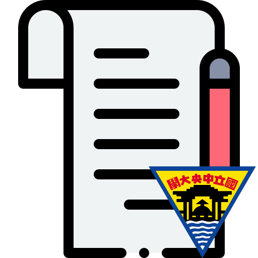
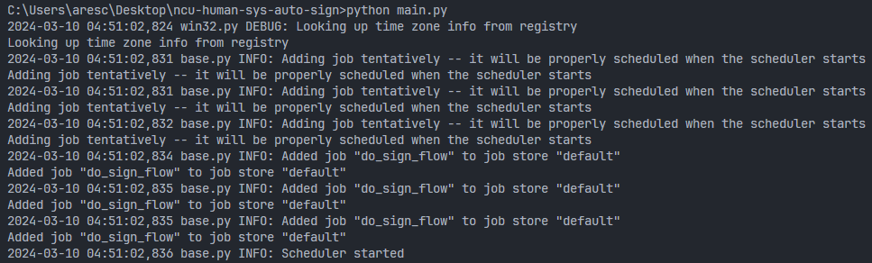

<br />
<div align="center">
  <a href="https://github.com/ares30841167/ncu-human-sys-auto-sign">
    
  </a>

  <h3 align="center">NCU Human Sys Auto Sign</h3>

  <p align="center">
    中央人事系統自動簽到退小工具
  </p>
</div>

## 關於專案

這是一支用於中央大學人事系統自動簽到退的小工具，能在排定的時間自動打卡，免除需要設定鬧鐘手動簽到退的惡夢。

目前程式開發的進度為，

- [x] 模擬簽到退請求並進行簽到退作業
- [X] 排程執行
- [X] 簽到結果推播通知 (例如 Discord 或 Slack)
- [ ] Web Server版 - 供多人同時使用

## 使用說明

此工具主要使用透過 Portal 記住我功能獲取的30天有效登入狀態 Cookie，模擬使用者登入 Portal 並從選單點選人事系統選項登入人事系統，最後對指定人事系統簽到頁面進行簽到退之動作。

30天有效登入狀態 Cookie 須由使用者自行先到 Portal 頁面使用記住我功能進行登入操作後，自行複製登入後的 Portal Cookie 狀態。

目前簽到結果推播通知以及其他部分尚未完成，若想要執行簽到流程測試，使用步驟如下，

1. 安裝專案所需的 python 相依套件

    ```python
    pip install -r requirements.txt
    ```

2. 使用者自行透過 Portal 頁面記住我功能進行登入，並複製 Portal Cookie 內容
3. 使用者自行進入到人事系統目標簽到頁面，並複製網址上的頁面 ID (ParttimeUsuallyId)
4. 在 ncu_hsys 資料夾下創建 .env 檔案，可參考 .env.example 進行設定，將上述複製的內容設置於 .env 內

    ```text
    PORTAL_TOKEN={Portal Cookie}
    PARTTIME_USUALLY_ID={ParttimeUsuallyId}
    ```

5. 在**專案根目錄**執行 ncu_hsys.sign_bot 可進行簽到退流程測試

    ```python
    python -m "ncu_hsys.sign_bot"
    ```

若要執行排程自動簽到，則使用步驟如下，

1. 安裝專案所需的 python 相依套件

    ```python
    pip install -r requirements.txt
    ```

2. 使用者自行透過 Portal 頁面記住我功能進行登入，並複製 Portal Cookie 內容
3. 使用者自行進入到人事系統目標簽到頁面，並複製網址上的頁面 ID (ParttimeUsuallyId)
4. 使用者自行至想要接收通知的 Discord 頻道，產生 Webhook 網址 (對頻道按右鍵點選編輯頻道，進到整合頁面新增)。
5. 在**專案根目錄**資料夾下創建 .env 檔案，可參考 .env.example 進行設定，將上述複製的內容設置於 .env 內，並設定簽到與簽退的排程時間，可使用[crontab.guru](https://crontab.guru/)小工具進行輔助

    ```text
    DISCORD_WEBHOOK_URL={Discord Webhook URL}
    PORTAL_TOKEN={Portal Cookie}
    PARTTIME_USUALLY_ID={ParttimeUsuallyId}
    SIGN_IN_DAY={Sign-in day at each month}
    SIGN_IN_HOUR={Sign-in hour each day}
    SIGN_IN_MINUTES={Sign-in minutes at each hour}
    SING_OUT_DAY={Sign-out day at each month}
    SIGN_OUT_HOUR={Sign-out hour each day}
    SIGN_OUT_MINUTES={Sign-out minutes at each hour}
    ```

6. 在**專案根目錄**執行 main.py 可進行排程自動簽到

    ```python
    python main.py
    ```

7. 執行程式後，可從程式訊息輸出窗口與 logs 目錄底下查看執行日誌

    

## 致謝

- [Notes icons created by Freepik - Flaticon](https://www.flaticon.com/free-icons/notes)